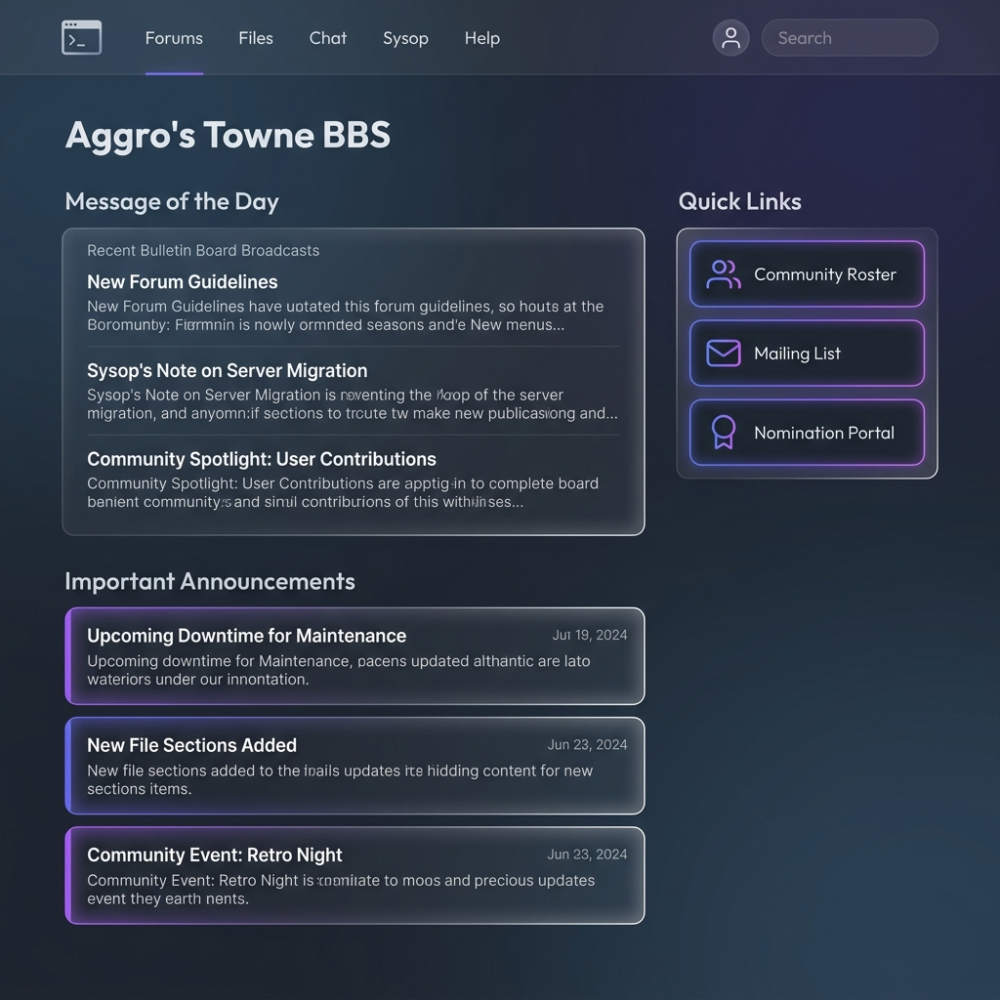

<div align="center">

# 🐾 Aggro's Towne BBS 🐾

[](https://spring.io/projects/spring-boot)
[](https://openjdk.org/)
[](https://supabase.com/)
[](https://spring.io/projects/spring-security)
[](https://getbootstrap.com/)

**Spring Boot 3.4.3 및 JSP 기반의 프리미엄한 웹 BBS(Bulletin Board System) 프로젝트**
*귀여운 마스코트 Cyber-Neko(Guide Neko)와 함께하는 다크-글래스모피즘(Dark Glassmorphism) 스타일의 레트로 BBS 테마입니다.*

---

### 🖥️ 홈페이지 프리뷰 (Main Preview)



---

</div>

## ✨ 주요 특징 (Key Features)

*   **🐱 귀여운 캐릭터 테마**: 마스코트 **Cyber-Neko**와 안내 말풍선, 통통 튀는 버튼 바운스 애니메이션 등 아기자기한 캐릭터 중심 디자인 적용
*   **🔮 Dark Glassmorphism UI**: 투명하고 화려한 반투명 유리(Glassmorphic) 카드 효과와 네온 핑크-시안 그라데이션 광원을 활용한 고품격 디자인
*   **🔒 강력한 보안 (Spring Security)**: JSP 내부 FORWARD 디스패치 및 정적 자원의 권한 우회 필터와 로그인/로그아웃 처리가 커스터마이징된 설정 탑재
*   **🗄️ 하이브리드 데이터베이스 아키텍처**: MyBatis와 JPA(Hibernate)를 혼합하여 Supabase PostgreSQL 클라우드 DB 연동 및 자동 스키마/데이터 초기화 지원
*   **📱 완벽한 반응형 레이아웃**: 모바일, 태블릿, PC 등 모든 스크린 사이즈에 맞춰 유동적으로 재배치되는 Bootstrap 5 그리드 탑재

---

## 🛠️ 기술 스택 (Technology Stack)

| 구분 | 기술 요소 |
| :--- | :--- |
| **Backend** | `Java 21`, `Spring Boot 3.4.3`, `Spring Security`, `JPA (Hibernate)`, `MyBatis` |
| **Database** | `PostgreSQL (Supabase Cloud)` / `H2 (Local In-Memory)` |
| **Frontend** | `JSP (Jakarta Server Pages)`, `Bootstrap 5`, `Vanilla CSS` |
| **Fonts** | `Fredoka` (제목용 둥근 폰트), `Quicksand` (본문용 둥근 폰트) |
| **Mascot** | `Chibi Cyber Cat (Generated Artwork)` |

---

## 🚀 시작 가이드 (Quick Start)

### 1. 전제 조건 (Prerequisites)
* **Java**: JDK 21 이상 설치 필수
* **Environment Variable**: `JAVA_HOME` 경로 지정

### 2. 소스 코드 빌드 및 로컬 구동 (Build & Run)
터미널을 열고 아래 명령어를 순서대로 실행합니다.

#### 💻 Windows PowerShell
```powershell
# 1. Java 21 환경 변수 세팅
$env:JAVA_HOME="C:\Program Files\Java\jdk-21.0.10"

# 2. 애플리케이션 시작
.\gradlew bootRun
```

#### 💻 Windows CMD (명령 프롬프트)
```cmd
set JAVA_HOME=C:\Program Files\Java\jdk-21.0.10
gradlew bootRun
```

#### 💻 Git Bash / macOS Terminal
```bash
export JAVA_HOME="/c/Program Files/Java/jdk-21.0.10"
./gradlew bootRun
```

### 3. 브라우저 접속 (Access URL)
서버가 켜지면 아래 주소로 접속 가능합니다:
* **홈페이지**: [http://localhost:8181](http://localhost:8181)
* **기본 로그인**: [http://localhost:8181/login](http://localhost:8181/login)

---

## ⚙️ 데이터베이스 초기화 설정
* `src/main/resources/application.properties` 에서 Supabase PostgreSQL 또는 로컬 H2 DB 설정을 변경할 수 있습니다.
* 어플리케이션 실행 시 [schema1.sql](src/main/resources/schema1.sql)과 [data1.sql](src/main/resources/data1.sql)이 자동으로 실행되어 DB 테이블 생성 및 초기 공지 데이터가 세팅됩니다.
